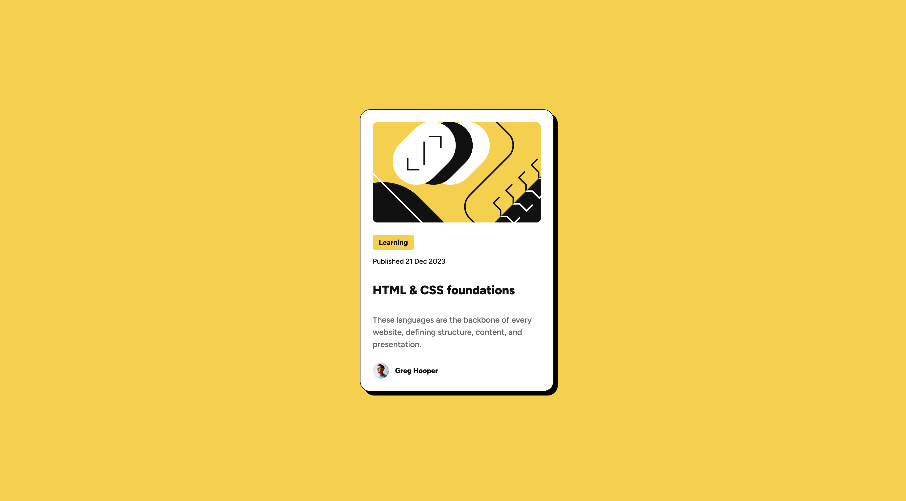

# Blog Preview Card

A responsive blog preview card built as part of the [Frontend Mentor](https://www.frontendmentor.io/challenges/blog-preview-card-ckPaj01IcS) challenge.

## Overview

This project showcases a modern blog card designed with hover effects, fluid typography, and accessible semantic markup.

### Screenshot



### Links

- Solution URL: [GitHub Repository](https://github.com/hakan-kemal/blog-preview-card)
- Live Site URL: [Netlify Deployment](https://blog-preview-card-hk.netlify.app/)

## My Process

### Built With

- Semantic HTML5 markup
- CSS custom properties
- Flexbox
- Mobile-first workflow
- Fluid typography using `clamp()`
- [Figtree](./assets/fonts/) - Local font files with `@font-face`

### What I Learned

This project helped me explore several interesting CSS concepts:

**Fluid Typography with clamp():**

```css
:root {
  --font-size-small: clamp(12px, 3.2vw, 14px);
  --font-size-medium: clamp(14px, 3.73vw, 16px);
  --font-size-large: clamp(20px, 5.33vw, 24px);
}
```

Using `clamp()` for font sizes creates truly responsive typography that scales smoothly between mobile and desktop without media queries.

**CSS Custom Properties for Design Tokens:** Organized colors and sizing into reusable CSS variables for maintainability:

```css
:root {
  --color-yellow: hsl(47, 88%, 63%);
  --color-gray-950: hsl(0, 0%, 7%);
  --spacing-300: 1.5rem;
  --radius-base: 1.25rem;
}
```

**Modern CSS Nesting:** Utilized native CSS nesting for hover states, keeping related styles together:

```css
.blog-title-link {
  color: var(--color-gray-950);
  text-decoration: none;
  transition: color 0.2s ease-in-out;

  &:hover,
  &:focus {
    color: var(--color-yellow);
  }
}
```

**Box Shadow Effects:** Created a bold, modern card design with offset shadows:

```css
.card {
  box-shadow: var(--shadow-base);
  border: 0.0625rem solid var(--color-gray-950);
  border-radius: var(--radius-base);
}
```

### Continued Development

Areas I want to focus on in future projects:

- Advanced CSS animations and transitions
- CSS Grid for more complex layouts
- Dark mode implementation with CSS variables
- Enhanced accessibility features (ARIA labels, keyboard navigation)

### Useful Resources

- [MDN Web Docs - clamp()](https://developer.mozilla.org/en-US/docs/Web/CSS/clamp) - Excellent guide on fluid typography
- [CSS-Tricks - CSS Nesting](https://css-tricks.com/css-nesting/) - Understanding native CSS nesting
- [Google Fonts](https://fonts.google.com/) - Font selection and optimization

## Author

- Frontend Mentor - [@hakan-kemal](https://www.frontendmentor.io/profile/hakan-kemal)
- GitHub - [@hakan-kemal](https://github.com/hakan-kemal)

## Acknowledgments

Thanks to Frontend Mentor for providing this challenge and the design specifications.
